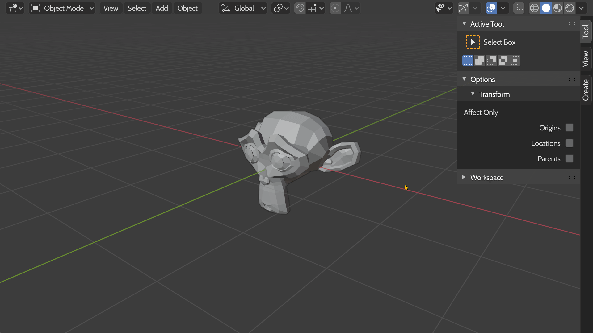

# Blender Ratio Scale

A Blender add-on for scaling object with exact X, Y or Z dimension.

## Installation

1. Open Blender
1. Go to *Edit* > *Preferences*
1. In the *Add-ons* tab, select *Install*
1. Choose the ZIP file downloaded from Github
1. Check the checkbox of the add-on

## Usage

### How to call

You can run the operator from the *Search Menu* (`F3`) or from the menu `Object > Transform > Ratio Scale`.\
If you cannot find the operator *Ratio Scale* in the search results or the button *Ratio Scale* in the menu is fade out, you need to have one active object first.

### How it works

When you invoke the operator, the panel will allow you to change the X, Y or Z dimension of the object while keeping its ratio.

### A demo

